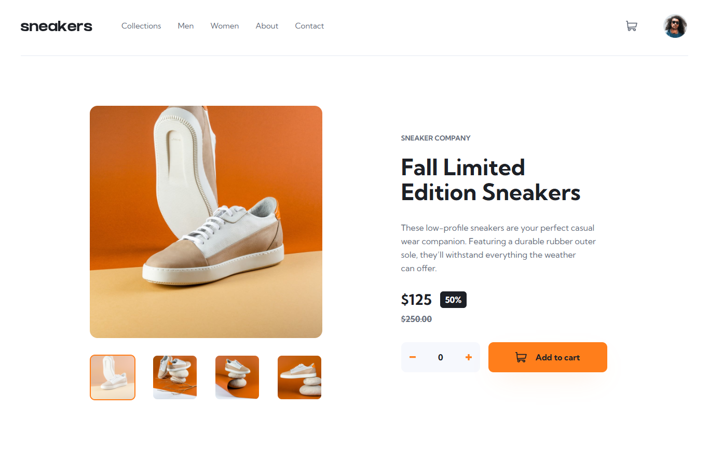

# Frontend Mentor - E-commerce Product Page Solution

This is a solution to the [E-commerce product page challenge on Frontend Mentor](https://www.frontendmentor.io/challenges/ecommerce-product-page-UPsZ9MJp6). The goal is to build a responsive e-commerce product page with interactive features using React and Vite.

## Table of Contents

- [Overview](#overview)
  - [The Challenge](#the-challenge)
  - [Screenshot](#screenshot)
  - [Links](#links)
- [Features](#features)
- [Built With](#built-with)
- [Getting Started](#getting-started)
- [Development Process](#development-process)
- [Continued Development](#continued-development)
- [Useful Resources](#useful-resources)
- [Author](#author)

## Overview

### The Challenge

Users should be able to:

- View the optimal layout for the site depending on their device's screen size
- See hover states for all interactive elements on the page
- Open a lightbox gallery by clicking on the large product image
- Switch the large product image by clicking on the small thumbnail images
- Add items to the cart
- View the cart and remove items from it

### Screenshot



### Links

- Solution URL: [Add your solution URL here](https://www.frontendmentor.io/solutions/e-commerce-product-page-Ewb49RiuNJ)
- Live Site URL: [E-commerce Product page](https://wahyuanandaa.github.io/Ecommerce-Product-Page/)

## Features

- Responsive design for desktop and mobile
- Interactive product image gallery with lightbox
- Cart functionality (add, view, remove items)
- Accessible navigation and controls

## Built With

- [React](https://reactjs.org/)
- [Vite](https://vitejs.dev/)
- CSS custom properties
- Flexbox & CSS Grid
- Mobile-first workflow

## Getting Started

To run this project locally:

```bash
pnpm install
pnpm run dev
```

Then open [http://localhost:5173](http://localhost:5173) in your browser.

## Development Process

- Component-based architecture for reusability and clarity
- State management using React hooks
- Responsive layout using CSS Grid and Flexbox
- Accessibility best practices for navigation and controls

## Continued Development

- Add unit and integration tests
- Improve accessibility (keyboard navigation, ARIA labels)
- Add animations for better UX
- Integrate with a backend or API for real product data

## Useful Resources

- [React Documentation](https://reactjs.org/docs/getting-started.html)
- [Vite Documentation](https://vitejs.dev/guide/)

## Author

- Frontend Mentor: [@Wahyuanandaa](https://www.frontendmentor.io/profile/Wahyuanandaa)

## Acknowledgments

Thanks to Frontend Mentor for the challenge and everyone who provided feedback and inspiration.
